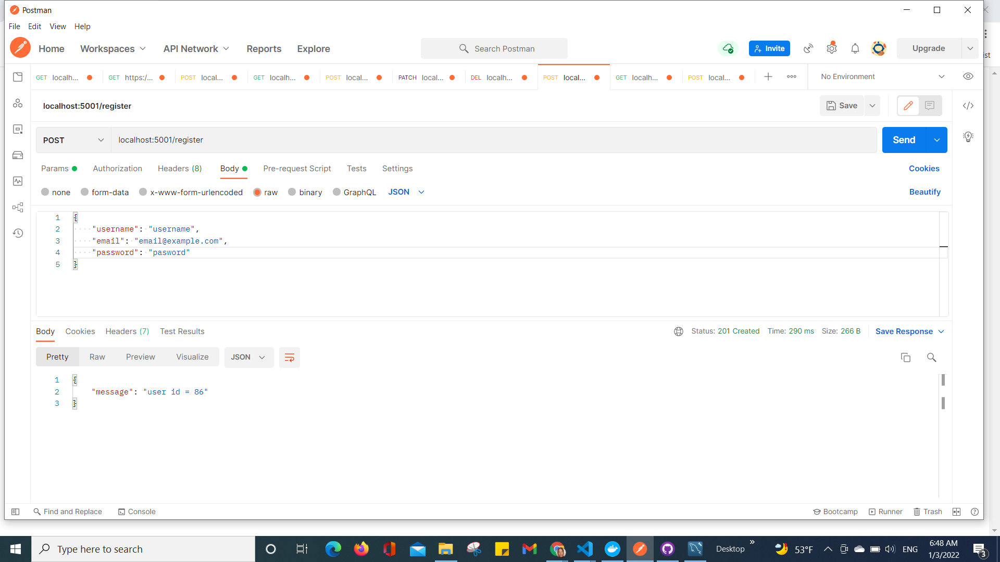
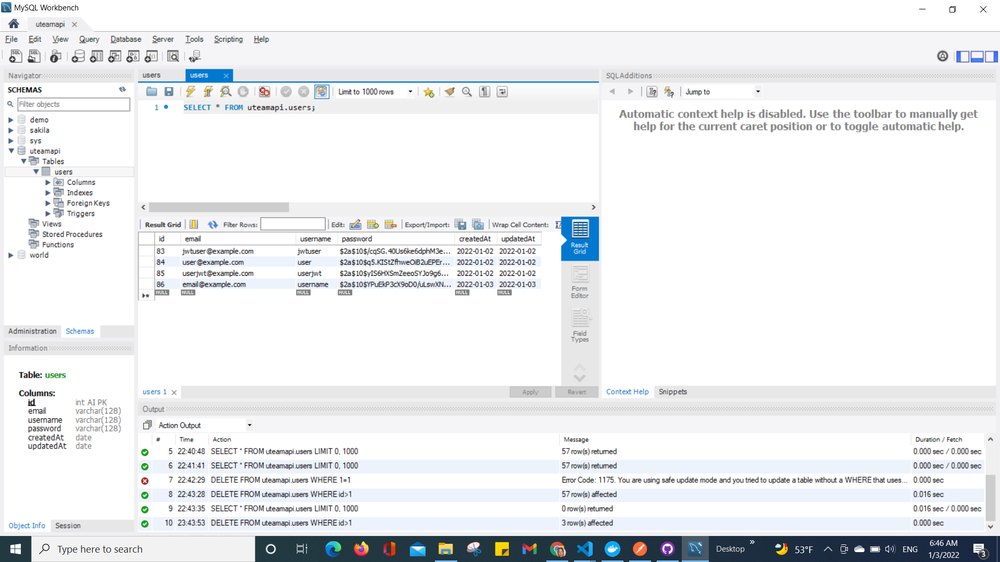
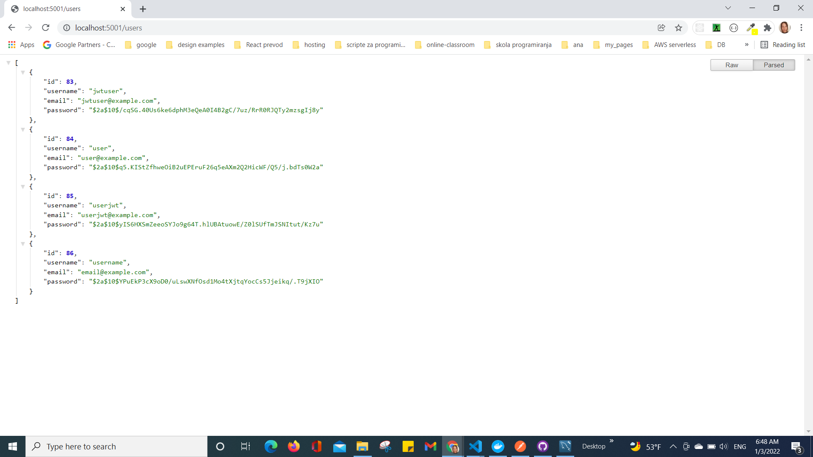
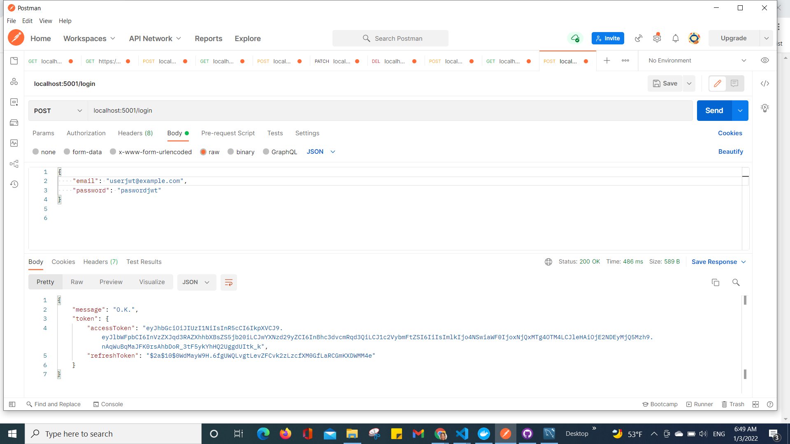
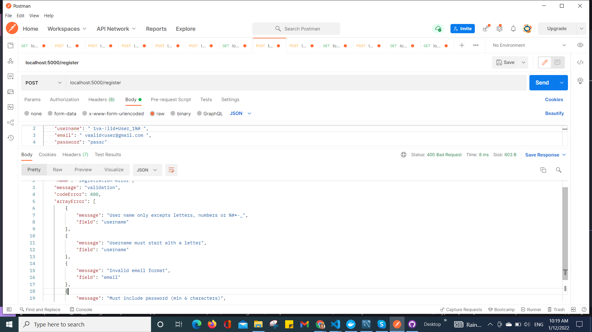
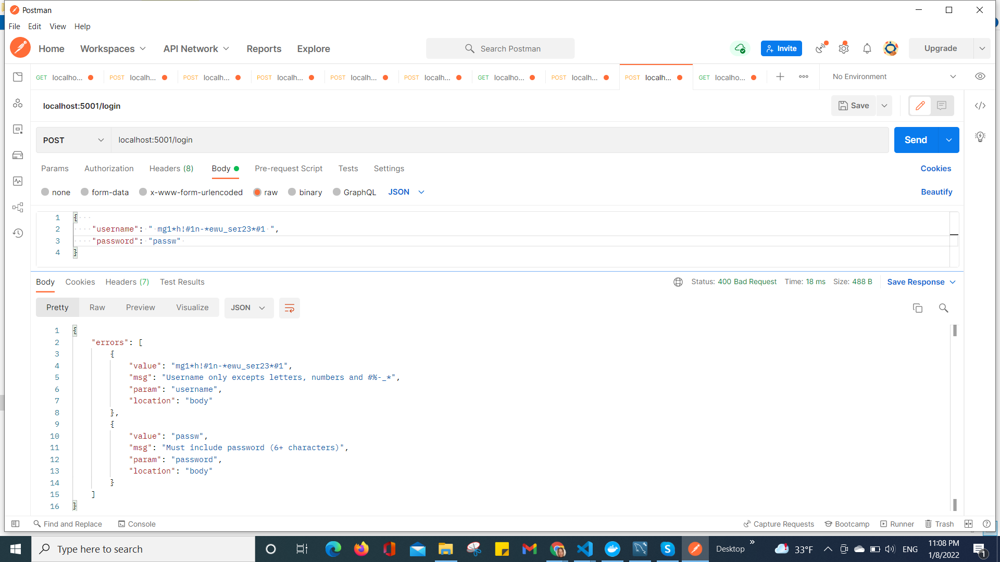
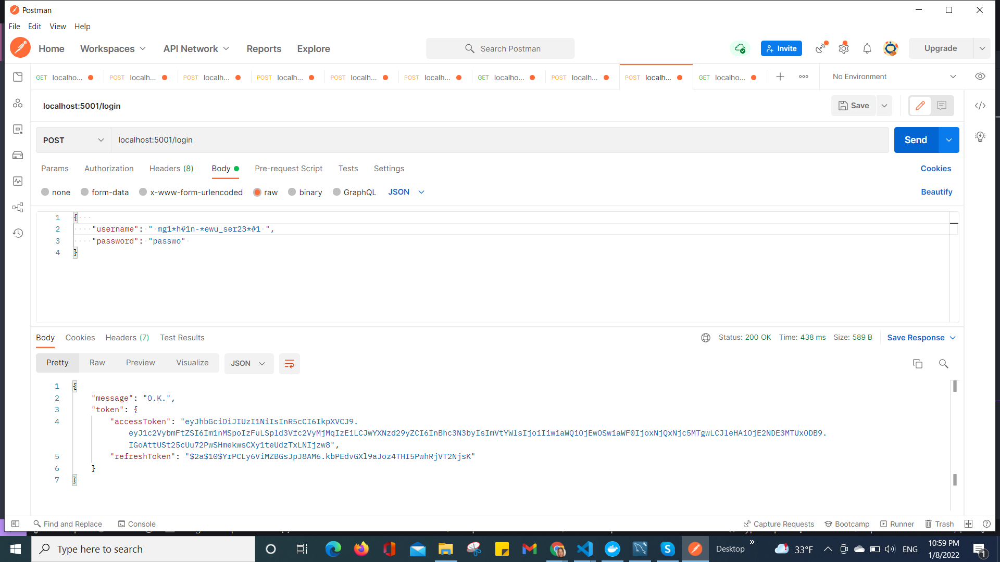

# Tatjana Marković Uteam api

## Table of contents

  - [Instruction](#instruction)
  - [Overview](#overview)
  - [Built with](#built-with)
  - [Screenshot](#screenshot)
  - [Author](#author)

## Instruction:
1. run server in development mode with
    npm run dev
2. production build with
    npm run build
    run server in production mode with
    npm start
3. compile TypeScript with
    tsc
4. find it on
    http://localhost:5001
5. start ESlint with
    npm run lint

## Overview
    Uteam is an api server that listens on port 5001
    Endpoints:
    1. '/' -  returns JSON  with confirmation that everything is O.K. 
    2. '/register' - new user registration (required: username, email and password), password hashed at db, return user id,
    3. '/login' - user login (required: username and password or  email and password), check password validity,
        create JWT , return O.K. message and JWT
    It was tested with the help of a Postman.

    Input Validation:
    Sanitisized with trim to remove white space
    1. username -  Must start with a letter, only excepts letters,  numbers and #%-_*
    2. email - example@example.com
    3. password - min 6 characters
## Build with 
    1. Node.js
    2. Express, body-parser, cors
    3. TypeScript
    4. ESlint
    5. MySQL2
    6. Sequelize
    7. Dotenv
    8. Body-parser
    9. Bcryptjs
    10. Jsonwebtoken
    11. Validator

### Screenshot

## Author
- Website - [Tatjana Markovic](https://my-react-portfolio-tatjana.vercel.app/)
- LinkedIn - [Tatjana Marković](https://www.linkedin.com/in/tatjana-markovi%C4%87-919501189/)
- GitHub - [tatjama](https://github.com/tatjama)

