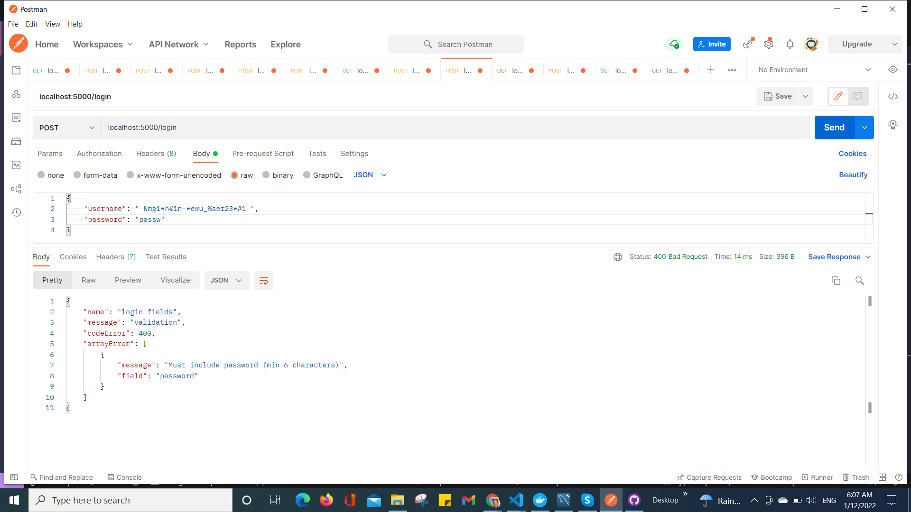

# Tatjana Marković Uteam api

## Table of contents

  - [Instruction](#instruction)
  - [Overview](#overview)
  - [Built with](#built-with)
  - [Screenshot](#screenshot)
  - [Author](#author)

## Instruction:
1. run server in development mode with
    npm run dev
2. production build with
    npm run build
    run server in production mode with
    npm start
3. compile TypeScript with
    tsc
4. find it on
    http://localhost:5000
5. start ESlint with
    npm run lint

## Overview
    Uteam is an api server that listens on port 5000

    ENDPOINTS:
    1. '/' -  returns JSON  with confirmation that everything is O.K. 
    2. '/register' - new user create (required: username, email and password), password hashed at db
                   - new profile create (required: name, optional: profilePhoto)
                   - new company create (optional: name, logo)    
                    return user id, 
    3. '/login' - user login (required: username and password or  email and password), 
                  using local passport authentication to check password validity and create JWT 
                  return JWT
    4. '/profiles'  
            - GET - returns list of profiles limit 20,
            - POST - new profile creation ( required: name, userId from JWT payload),
                    protected route with JWT passport authentication
                    return profile id  
    5. '/profiles/: id' 
            - GET - returns one profile with id,
            - PUT - update profile, protected route with JWT passport authentication,
                    return updated profile
            - DELETE - delete profile, protected route with JWT passport authentication,
                    return number of affected profile rows
    6. '/companies'
            - GET - return list of companies limit 20,
            - POST - new company creation ( required: name, userId as companyOwner from JWT payload)
                     protected route with JWT passport authentication
                     return company id             
    7. '/companies/: id'
            - GET - return one company with id,
            - PUT - update company, protected route with JWT passport authentication,
                    return updated company
            - DELETE - delete company, protected route with JWT passport authentication,
                    return number of affected company rows

    It was tested with the help of a Postman.

    INPUT VALIDATION:
    Sanitisized with trim to remove white space
    User:
        1. username -  Must start with a letter, only excepts letters,  numbers and #%-_*
        2. email - example@example.com
        3. password - min 6 characters
    Profile:
        4. name - only letters and numbers
        5. profilePhoto - only url
    Company:
        6. name - Only excepts letters,  numbers and #%-_*'
        7. logo - only url

    RELATIONS:
        user and profile = one to one,  
        one company has many profiles,
        user has many companies
## Build with 
    1. Node.js
    2. Express, body-parser, cors
    3. TypeScript
    4. ESlint
    5. MySQL2
    6. Sequelize
    7. Dotenv
    8. Body-parser
    9. Bcryptjs
    10. Jsonwebtoken
    11. Validator
    12. Passport, passport-local, passport-jwt

### Screenshot

;
;
;
;
;
;
;
;
;

## Thanks to

[Slugify](https://gist.github.com/mathewbyrne/1280286)

## Author
- Website - [Tatjana Markovic](https://my-react-portfolio-tatjana.vercel.app/)
- LinkedIn - [Tatjana Marković](https://www.linkedin.com/in/tatjana-markovi%C4%87-919501189/)
- GitHub - [tatjama](https://github.com/tatjama)

